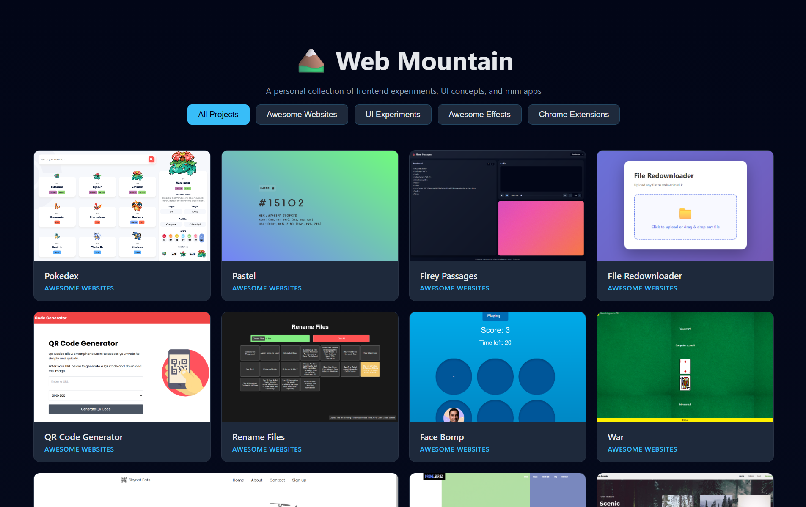

# Web Mountain 🏔️



A comprehensive repository showcasing frontend experiments, UI concepts, and interactive web applications. Each project demonstrates different aspects of modern web development, from accessibility best practices to advanced animations and interactive experiences.

## Project Categories

### Awesome Websites

Complete website projects ranging from interactive games to practical utilities.

- **[Pokedex](./Awesome%20Websites/Pokedex)** - Interactive Pokemon encyclopedia
- **[Pastel](./Awesome%20Websites/Pastel)** - Bootstrap-based portfolio template
- **[Bulk File Renamer](./Awesome%20Websites/Bulk%20File%20Renamer)** - Batch file renaming tool
- **[Firey Passages](./Awesome%20Websites/Firey%20Pasages)** - Animated text effects showcase
- **[File Redownloader](./Awesome%20Websites/File%20Redownloader)** - Batch file download utility
- **[QR Code Generator](./Awesome%20Websites/QR%20Code%20Generator)** - Dynamic QR code creation tool
- **[Mock Email Generator](./Awesome%20Websites/Mock%20Email%20Generator)** - Interactive mock email generator
- **[Rename Files](./Awesome%20Websites/Rename%20Files)** - Batch file renaming tool
- **[Face Bomp](./Awesome%20Websites/Face%20Bomp)** - Whack-a-mole style reaction game
- **[War](./Awesome%20Websites/War)** - Classic card game implementation
- **[UNO](./Awesome%20Websites/UNO)** - Another Classic card game implementation

### UI Experiments

Creative UI concepts and experimental interface designs.

- **[Skynet Eats](./UI%20Experiments/Skynet%20Eats)** - Food delivery app UI concept
- **[Drone Series](./UI%20Experiments/Drone%20Series)** - Drone product showcase interface
- **[Scenic Forests](./UI%20Experiments/Scenic%20Forests)** - Nature photography gallery interface
- **[Momentum](./UI%20Experiments/Momentum)** - Minimalist productivity dashboard
- **[Video Background Website](./UI%20Experiments/Video%20Background%20Website)** - Immersive video-based landing page

### Awesome Effects

Interactive visual effects and animations that demonstrate creative uses of CSS, JavaScript, and WebGL.

- **[Ghost Eyes](./Awesome%20Effects/Ghost%20Eyes.html)** - Spooky eye-tracking effect
- **[Grid Spotlight Effect](./Awesome%20Effects/GridSpotlightEffect.html)** - Interactive grid spotlight animation
- **[Anime.js Sphere](./Awesome%20Effects/Anime.js%20Sphere)** - 3D animated sphere using Anime.js
- **[Anthony V1 Website Effects](./Awesome%20Effects/Anthony%20V1%20Website%20Effects)** - Custom cursor and mouse-follow effects
- **[Blue Techno Fluid](./Awesome%20Effects/Blue%20Techno%20Fluid)** - WebGL fluid simulation
- **[Diamond Photo Gallery](./Awesome%20Effects/Diamond%20Photo%20Gallery)** - Diamond-shaped image gallery layout
- **[Fluid Flame Effect](./Awesome%20Effects/Fluid%20Flame%20Effect)** - Interactive flame simulation
- **[Button Gallery](./Awesome%20Effects/Button%20Gallery)** - Collection of creative button hover effects
- **[Ink Fluid](./Awesome%20Effects/Ink%20Fluid)** - GPU-accelerated ink dispersion effect
- **[Loading Animation 2](./Awesome%20Effects/Loading%20Animation%202)** - Creative loading spinner animation
- **[Moving Squares Animation](./Awesome%20Effects/Moving%20Squrares%20Animation)** - Animated square pattern effects
- **[Particles](./Awesome%20Effects/Particles)** - Interactive particle system visualization
- **[Split Screen Slider](./Awesome%20Effects/Split%20Screen%20Slider)** - Dual-panel slider interface
- **[Spotlight Effect](./Awesome%20Effects/Spotlight%20Effect)** - Mouse-tracking spotlight effect
- **[Touch Slider](./Awesome%20Effects/Touch%20Slider)** - Touch-enabled image slider
- **[Video.js](./Awesome%20Effects/Video.js)** - Custom video player implementation
- **[3D Cube Loader](./Awesome%20Effects/3D%20Cube%20Loader.html)** - Animated 3D cube loading animation
- **[3D Image Transition](./Awesome%20Effects/3D%20Image%20Transition.html)** - 3D perspective image transitions
- **[Animated Input Border](./Awesome%20Effects/Animated%20Input%20Border.html)** - Dynamic input field border animations
- **[Escalade Loader](./Awesome%20Effects/Escalade%20Loader.html)** - Escalating animation loader
- **[Fire Cursor](./Awesome%20Effects/Fire%20Cursor.html)** - Cursor trail with fire particle effect
- **[Gemini Loader](./Awesome%20Effects/Gemini%20Loader.html)** - Google Gemini-inspired loading animation
- **[Hover Shine Effect](./Awesome%20Effects/Hover%20Shine%20Effect.html)** - Metallic shine on hover interaction
- **[Jump And Slide](./Awesome%20Effects/Jump%20And%20Slide.html)** - Playful jump and slide animation
- **[Magic Card](./Awesome%20Effects/Magic%20Card.html)** - Interactive card with magical hover effects
- **[MagicalHoverEffect](./Awesome%20Effects/MagicalHoverEffect.html)** - Enchanting hover interaction with particles
- **[Navigation Bar](./Awesome%20Effects/Navigation%20Bar.html)** - Animated navigation bar with hover effects
- **[Redirecting Loader](./Awesome%20Effects/Redirecting%20Loader.html)** - Page redirect loading animation
- **[Shine Animation](./Awesome%20Effects/Shine%20Animation.html)** - Animated shine sweep effect
- **[Shine Effect](./Awesome%20Effects/Shine%20Effect.html)** - Glossy shine overlay effect

### Chrome Extensions

Browser extensions that enhance functionality and user experience.

- **[Gallery Bookmark Viewer](./Chrome%20Extensions/Gallery%20Bookmark%20Viewer)** - Visual bookmark management extension with customizable viewing options

## Setup

To explore these projects locally:

1. Clone the repository:

```bash
   git clone https://github.com/AbdulDevHub/Web-Mountain.git
```

1. Navigate to the project directory:

```bash
   cd Web-Mountain
```

1. Open `index.html` in your browser to view the project showcase

2. Navigate to individual project folders to explore specific implementations

## Technologies Used

- **Core**: HTML5, CSS3, JavaScript (ES6+)
- **Animation**: Anime.js, CSS animations, Canvas API
- **Graphics**: WebGL, GPU.js, SVG
- **Libraries**: jQuery, Bootstrap, dat.GUI
- **Tools**: Materialize, Video.js
- **Techniques**: CSS Grid, Flexbox, Responsive Design

## Purpose

This repository serves as a living archive of frontend learning experiments, showcasing progression in web development skills across multiple domains including:

- ✨ Visual effects and animations
- 🎮 Interactive applications and games
- 🎨 UI/UX design implementations
- 🔧 Practical web utilities
- 🧩 Chrome extension development

Each project demonstrates different aspects of modern web development, from foundational concepts to advanced techniques.

**_Feel free to explore each project folder for implementation details. Happy Coding!_** 🚀
